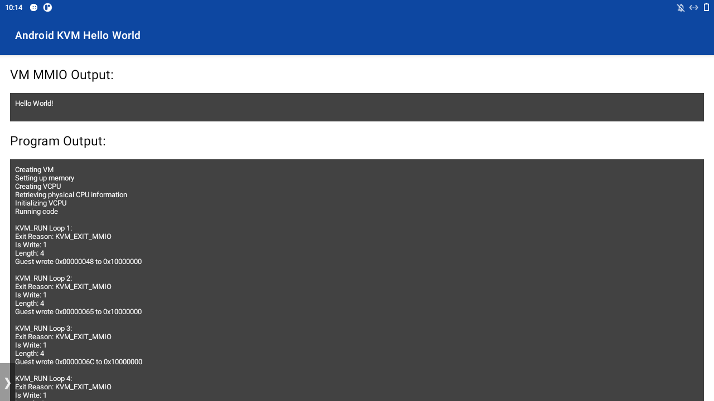

# Prerequisites

This app will only run successful on Android 12. Also the permissions of the file `/dev/kvm` on Android need to be changed, so that all users have read and write permission.

# About

This app runs a [c++ program](https://github.com/Lenz-K/android-kvm-hello-world/blob/main/app/src/main/cpp/kvm_test.cpp), 
that sets up a KVM AArch64 VM and runs a bare metal AArch64 hello-world-program in the VM.
The bare metal program is included as an ELF file [hello_world.elf](https://github.com/Lenz-K/android-kvm-hello-world/blob/main/app/src/main/res/raw).
It is developed in another [repository](https://github.com/Lenz-K/arm64-kvm-hello-world/tree/main/bare-metal-aarch64).
The app was tested on a Cortex-A72 (ARMv8-A) processor running Android 12.

