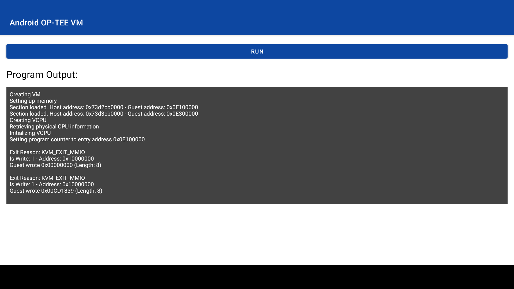

# Prerequisites

This app will only run successful on Android 12.
Also the permissions of the file `/dev/kvm` on Android need to be changed,
so that all users have read and write permission.
See the last section of this file for more information.

# About

This app runs a [c++ program](https://github.com/Lenz-K/android-kvm-hello-world/blob/main/app/src/main/cpp/kvm_test.cpp), 
that sets up a KVM AArch64 VM and runs a OP-TEE OS build in the VM.
The OP-TEE OS is included as an ELF file [tee.elf](https://github.com/Lenz-K/android-kvm-hello-world/tree/main/app/src/main/assets/bin).
It is developed in another [repository](https://github.com/Lenz-K/optee_os_kvm/tree/plat-kvm).

The app contains a `RUN` button. When it is clicked a world switch to the VM is performed.
The VM runs until an exception returns the control to the hypervisor, which will return to the app.
Several MMIO 'breakpoints' were added to the OP-TEE OS which will trigger such an exception.
The [second breakpoint](https://github.com/Lenz-K/optee_os_kvm/blob/plat-kvm/core/arch/arm/kernel/entry_a64.S#L401) is before the [instruction](https://github.com/Lenz-K/optee_os_kvm/blob/plat-kvm/core/arch/arm/kernel/entry_a64.S#L402) that enables the MMU.
The [third breakpoint](https://github.com/Lenz-K/optee_os_kvm/blob/plat-kvm/core/arch/arm/kernel/entry_a64.S#L404) is after the instruction that enables the MMU.
The third breakpoint will never be reached because the instruction that enables the MMU fails.
This is because OP-TEE OS was written to run in ARM secure state
and the MMU configuration does not work in non-secure state.

The app was tested on a Cortex-A72 (ARMv8-A) processor running Android 12.



# Changing the permissions of '/dev/kvm'

Changing the permissions of `/dev/kvm` requires root privileges on the Android device.
First connect adb to the device.
Instructions for different setups can be found [here](https://developer.android.com/studio/command-line/adb).

To change the permissions until the next boot, issue the following command:
```
adb shell chmod a+rw /dev/kvm
```

To change the permissions on every boot, one can add the command to an init file of an Android device.
There are usually several of these files and name and location can vary.
Find more information on this [here](https://android.googlesource.com/platform/system/core/+/master/init/README.md).
On the development device of this repository, the file was located at `/etc/init/init-debug.rc`.
To edit the file, pull it to your machine:
```
adb pull /etc/init/init-debug.rc
```

Then add the following lines to the end of the file.
```
on boot
    chmod a+rw /dev/kvm
```

Then push it back to the device.
```
adb push init-debug.rc /etc/init/init-debug.rc
```
On the next boot of the device, the permissions should be changed automatically.
